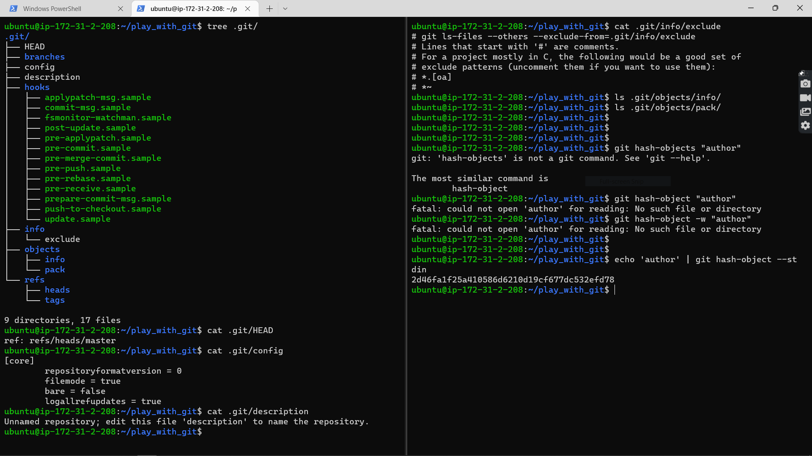
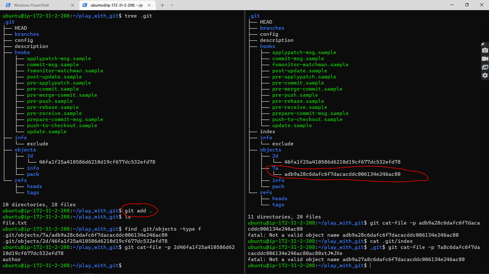
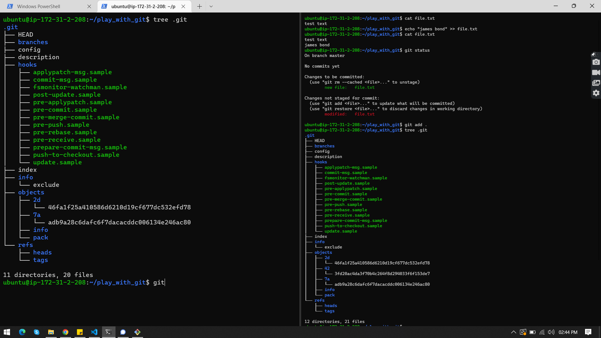
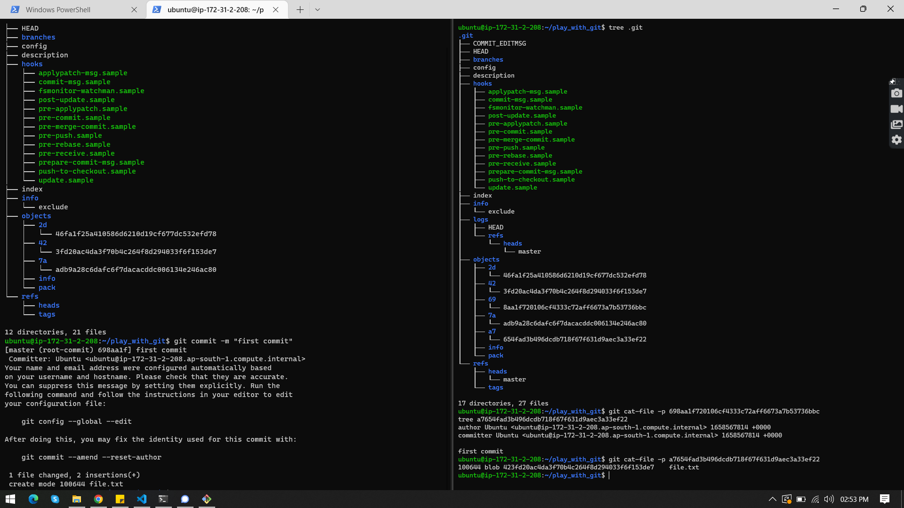

# Git Objects

`git init`
`tree .git/`


Git is a content-addressable filesystem. Great. What does that mean? It means that at the core of Git is a simple key-value data store. What this means is that you can insert any kind of content into a Git repository, for which Git will hand you back a unique key you can use later to retrieve that content.

```
find .git/objects -type f
.git/objects/2d/46fa1f25a410586d6210d19cf677dc532efd78

git cat-file -p 2d46fa1f25a410586d6210d19cf677dc532efd78
author

# as you can see starting two bytes of key is used to name the directory "2d"
```

[Click here for more on Git Objects](https://git-scm.com/book/en/v2/Git-Internals-Git-Objects)

### add a file

- echo 'newfile' > file.txt
- no change in .git directory
- git add .
- a object is created similar to the above one under .git/objects directory
- the object type is **blob**



### modifying existing file

- echo "james bond" > file.txt
- git add .
- a new key is generated rather than changing the existing one.



### restoring from the modified data

- git restore --staged file.txt
- no new object is created, that means old object is used.

### commiting the changes

- git commit -m "first commit"
- it created another two objects
- first one is object of tree which have the key of last object before tree object created.
- second object have all the details that is newly created tree key, author, committer, and commit message


